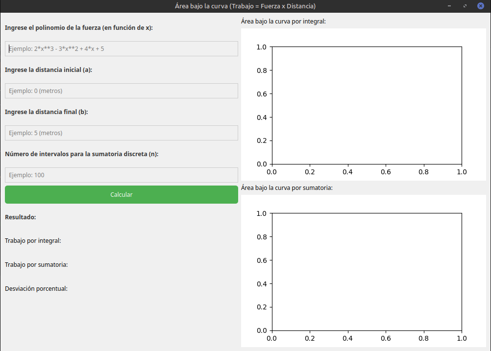
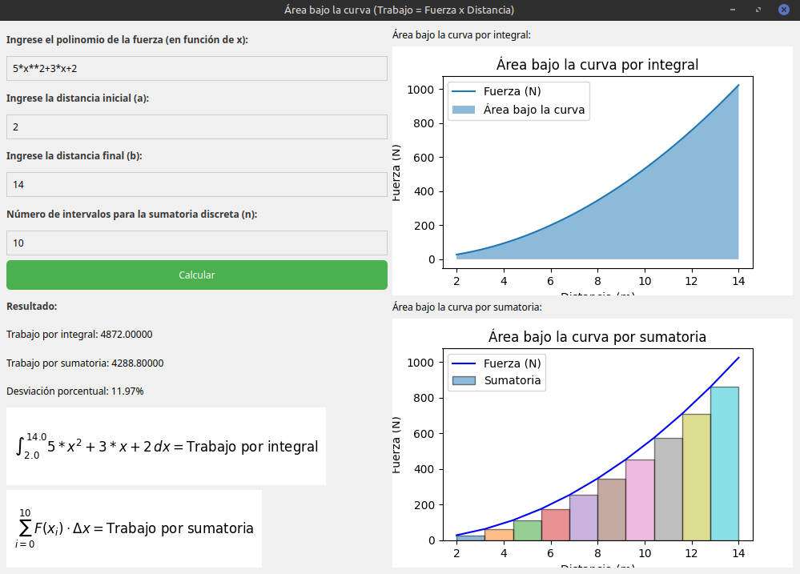
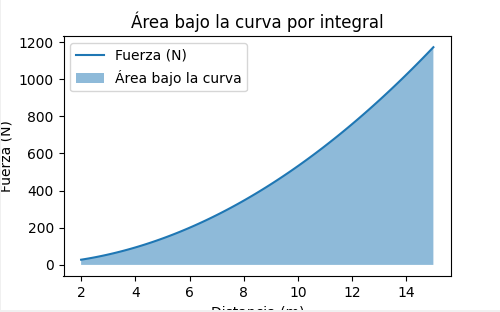
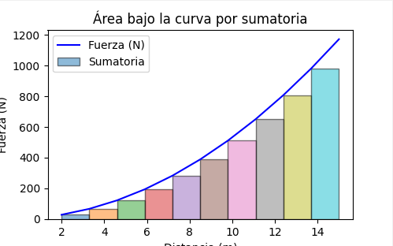

# Force Work Calculator

This repository contains a Python application that calculates the work done by a variable force using two methods: numerical integration and rectangular partition summation. The user inputs the force function, limits of integration, and the number of partitions through a graphical interface developed with PyQt5.

## Requirements

Before running the program, ensure you have the following dependencies installed:

- Python 3.13.0 or newer
- NumPy: `pip install numpy`
- SciPy: `pip install scipy`
- PyQt5: `pip install PyQt5`
- Matplotlib: `pip install matplotlib`

## Getting Started

### 1. Clone the repository

```bash
git clone https://github.com/lino62U/VariableForce-SumIntegration.git
cd VariableForce-SumIntegration
```

### 2. Install the dependencies

You can use `pip` to install the required Python libraries. Make sure to run the following command in your terminal:

```bash
pip install numpy scipy PyQt5 matplotlib
```

### 3. Run the application

To run the application, simply execute the Python script:

```bash
python main.py
```
### 4. Using the Application

Once the program is running, a graphical user interface (GUI) will appear where you can input the following data:

- **Force Function**: By default, the function used is $F(x) = 5x^2 + 3x + 2$, but this can be modified in the code if needed.
- **Limits of Integration**: Enter the lower and upper limits for the integration.
- **Number of Partitions**: Specify the number of partitions (n) for the rectangular summation method.

#### Example:
- **Force Function**: $F(x) = 5x^2 + 3x + 2$
- **Limits of Integration**: $a = 2, b = 14$
- **Number of Partitions**: $n = 10$

Once you fill in the data, the system will calculate the work using both methods: numerical integration and summation of rectangular partitions. The results will be displayed in the GUI along with the generated graphs showing the area under the curve.

#### Interfaz Gráfica
Below is an image of the user interface developed with PyQt:




In this interface, the user can input the force function, the limits of integration \(a\) and \(b\), and the number of partitions \(n\).

#### Results

After entering the parameters and running the calculations, the results will be shown as both numerical values and graphs. The figures below illustrate the area under the curve calculated using integration and the rectangular partition summation:

- **Work by Integration** – Using the `scipy.integrate.quad` method.
- **Work by Rectangular Summation** – Based on the specified number of partitions.

##### Work by Integration:



##### Work by Rectangular Summation 10 rectangles:



These results are saved in the `result` folder for easy reference and review.

## Output

The program will display two key results:
1. **Work by Integration** – Using the `scipy.integrate.quad` method.
2. **Work by Rectangular Summation** – Based on the specified number of partitions.

Additionally, graphs representing the area under the force curve for both methods will be shown.

## License

This project is licensed under the MIT License - see the [LICENSE](LICENSE) file for details.

